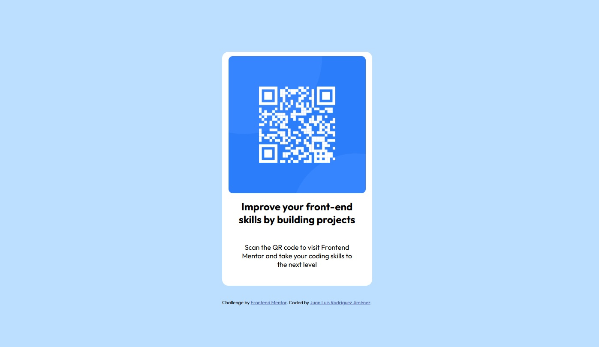

# Frontend Mentor - QR code component solution

This is a solution to the [QR code component challenge on Frontend Mentor](https://www.frontendmentor.io/challenges/qr-code-component-iux_sIO_H). Frontend Mentor challenges help you improve your coding skills by building realistic projects. 

## Table of contents

- [Overview](#overview)
  - [Screenshot](#screenshot)
  - [Links](#links)
- [My process](#my-process)
  - [Built with](#built-with)
  - [What I learned](#what-i-learned)
  - [Continued development](#continued-development)
  - [Useful resources](#useful-resources)
- [Author](#author)
- [Acknowledgments](#acknowledgments)

**Note: Delete this note and update the table of contents based on what sections you keep.**

## Overview

### Screenshot

### Links

- Solution URL: https://github.com/Master-Chowan/QR-code-component-challenge
- Live Site URL: https://master-chowan.github.io/QR-code-component-challenge/

## My process

### Built with

- Semantic HTML5 markup
- CSS custom properties
- Flexbox

### What I learned - Tools and Techniques

### HTML
- **Meta Viewport Tag**: Added `<meta name="viewport" content="width=device-width, initial-scale=1.0">` to ensure proper scaling and rendering on mobile devices, enabling the browser to adjust the page's width to the device's screen size.
- **Semantic Structure**: Maintained a clean and semantic HTML structure using elements like `
` with meaningful class names (e.g., `.container`, `.card`) to organize content logically.

### CSS
- **Relative Units**:
  - Used percentage-based units (e.g., `width: 90%` for `.card`) and `max-width` to create fluid layouts that adapt to different screen sizes.
  - Applied `vw`, `rem`, and `em` units implicitly through font sizes and margins to ensure scalability.
  - Set `height: auto` for images to maintain aspect ratios.
- **Flexbox**:
  - Utilized `display: flex` with `flex-direction: column`, `justify-content: center`, and `align-items: center` in `.container` to center content both vertically and horizontally across devices.
- **Media Queries**:
  - Implemented breakpoints at `max-width: 600px` and `max-width: 400px` to adjust styles (e.g., font sizes, margins, image sizes) for smaller screens, ensuring readability and proper spacing.
- **Box Sizing**:
  - Applied `box-sizing: border-box` to `.card` to ensure padding and borders are included in the element's width, preventing overflow.
- **Responsive Images**:
  - Configured images with `width: 100%` and `max-width` to scale fluidly within their container while maintaining a maximum size, paired with `height: auto` to preserve aspect ratios.
- **Typography Adjustments**:
  - Adjusted font sizes (e.g., `font-size: 1.2rem` for `h2` on smaller screens) and margins dynamically using media queries to improve legibility on mobile devices.
- **Padding and Margins**:
  - Added `padding: 1rem` to `.container` to prevent content from touching screen edges on smaller devices.
  - Reduced margins (e.g., `margin: 0.8rem` for `p` and `h2` in media queries) to optimize space on smaller screens.

### Continued development

I need to reinforce my knowledge in HTML and CSS

### Useful resources

- [resource 1](https://www.youtube.com) - This page helps me with tutorials from different authors.

## Author

- Frontend Mentor - [@Master-Chowan](https://www.https://www.frontendmentor.io/profile/Master-Chowan)